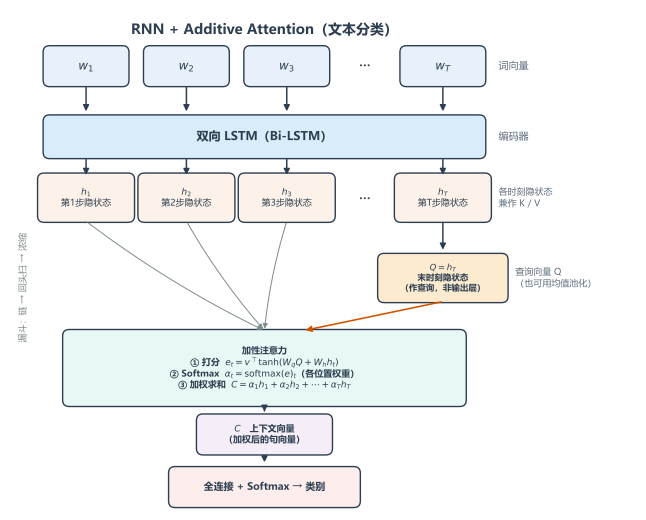
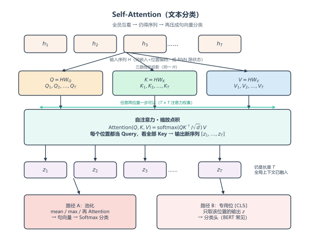

# RNN + Attention 文本分类

### 核心思想

文本分类只需给整句贴一个标签，因此目标只有一件事：用 Attention 把变长句子压成**一个固定长度、带重点的句向量**，再交给全连接层分类。

与翻译不同：这里没有逐步变化的解码器，Attention **只算一次**。本节模型用的是 **Additive Attention（加性注意力）**。

完整实验：`code_demo/RNN_attention/`（说明见同目录 `实验.md`）。数据为 **AG News 小型子集**（4 类多分类）。`setting.ATTN_TYPE` 可切 `additive` / `scaled_dot` / `self`：

```bash
cd code_demo/RNN_attention
python train.py
```

### 模型长什么样：RNN + 加性注意力

<div align="center">
    
</div>

像一个「漏斗」：RNN 先拉出一条长链，再从末尾揪出一个「头」（Q），用加性打分回头扫描整条链，浓缩成一个精华向量，喂给分类器。

1. **输入**：一句话的词向量 $$[w_1, w_2, \ldots, w_T]$$
2. **RNN（双向 LSTM）**：过一遍，输出每个时刻的隐状态 $$[h_1, h_2, \ldots, h_T]$$——这就是「候选信息库」，同时充当 K 和 V。
3. **生成 Q**：取最后一个时刻 $$h_T$$（或对所有时刻取平均）作为查询向量——代表「我现在要看全貌了」。
4. **加性打分**：对每个位置 $$t$$，不直接点积，而是

$$
e_t = v^\top \tanh(W_q Q + W_h h_t)
$$

5. **加权汇总**：$$\alpha = \mathrm{softmax}(e)$$，上下文向量 $$C = \sum_t \alpha_t h_t$$。
6. **分类**：把 $$C$$（有时拼接上 Q）送入 Softmax 全连接层，输出类别。

对应实现（`model.py`，`ATTN_TYPE="additive"`）：

```python
class AdditiveAttention(nn.Module):
    """e_t = v^T tanh(W_q Q + W_h h_t)，再 Softmax 加权求和。"""

    def __init__(self, hidden_dim: int):
        super().__init__()
        self.W_q = nn.Linear(hidden_dim, hidden_dim, bias=False)
        self.W_h = nn.Linear(hidden_dim, hidden_dim, bias=False)
        self.v = nn.Linear(hidden_dim, 1, bias=False)

    def forward(self, query, keys, mask=None):
        # query: (B, H)  keys: (B, T, H)
        q = self.W_q(query).unsqueeze(1)  # (B, 1, H)
        h = self.W_h(keys)  # (B, T, H)
        scores = self.v(torch.tanh(q + h)).squeeze(-1)  # (B, T)
        if mask is not None:
            scores = scores.masked_fill(~mask, -1e9)
        alpha = torch.softmax(scores, dim=-1)  # (B, T)
        context = torch.bmm(alpha.unsqueeze(1), keys).squeeze(1)  # (B, H)
        return context, alpha


class BiLSTMAttnClassifier(nn.Module):
    """BiLSTM + 一次 Attention → 句向量 → 分类。"""

    def forward(self, input_ids, lengths):
        emb = self.embedding(input_ids)
        packed = nn.utils.rnn.pack_padded_sequence(
            emb, lengths.cpu(), batch_first=True, enforce_sorted=False
        )
        packed_out, _ = self.lstm(packed)
        H, _ = nn.utils.rnn.pad_packed_sequence(packed_out, batch_first=True)  # (B, T, 2H)

        # Q = 末有效时刻 h_T；K/V = 整句隐状态 H
        last_idx = (lengths - 1).clamp(min=0)
        batch_idx = torch.arange(H.size(0), device=H.device)
        query = H[batch_idx, last_idx]

        mask = torch.arange(H.size(1), device=H.device).unsqueeze(0) < lengths.unsqueeze(1)
        context, alpha = self.attn(query, H, mask=mask)
        sent = self.dropout(torch.cat([context, query], dim=-1))  # 拼接 C 与 Q
        return self.fc(sent), alpha
```

### 缩放点积注意力

加性注意力用一层小网络打分；缩放点积则更省事——**直接拿 Q 和 K 做点积**，再除以 $$\sqrt{d}$$：

$$
\mathrm{Attention}(Q, K, V) = \mathrm{softmax}\!\left(\frac{Q K^\top}{\sqrt{d}}\right) V
$$

为什么要除 $$\sqrt{d}$$：维度一高，点积方差约等于 $$d$$，分数容易炸，Softmax 接近 one-hot，梯度变差。除以 $$\sqrt{d}$$ 把尺度拉回温和区间。

落到本文的分类设定里，也可以把加性换成缩放点积：

1. **K、V**：仍是各时刻隐状态 $$[h_1,\ldots,h_T]$$（拼成矩阵 $$H$$）。
2. **Q**：仍是 $$h_T$$（或均值）经线性变换得到。
3. **打分**：$$e = \dfrac{Q H^\top}{\sqrt{d}}$$，再 Softmax 得 $$\alpha$$，$$C = \alpha H$$。
4. **分类**：同前，把 $$C$$ 送入全连接层。

与加性比：无需额外的 $$W_q, W_h, v$$ 打分网络，矩阵乘法即可；维度高时通常更稳、更快。Transformer 里用的就是这一套。

分类器骨架不变，只换打分模块（`ATTN_TYPE="scaled_dot"`）：

```python
class ScaledDotProductAttention(nn.Module):
    """Attention(Q,K,V) = softmax(Q K^T / sqrt(d)) V，此处单 Query。"""

    def __init__(self, hidden_dim: int):
        super().__init__()
        self.W_q = nn.Linear(hidden_dim, hidden_dim, bias=False)
        self.scale = math.sqrt(hidden_dim)

    def forward(self, query, keys, mask=None):
        # query: (B, H)  keys/values: (B, T, H)
        q = self.W_q(query).unsqueeze(1)  # (B, 1, H)
        scores = torch.bmm(q, keys.transpose(1, 2)).squeeze(1) / self.scale  # (B, T)
        if mask is not None:
            scores = scores.masked_fill(~mask, -1e9)
        alpha = torch.softmax(scores, dim=-1)
        context = torch.bmm(alpha.unsqueeze(1), keys).squeeze(1)
        return context, alpha
```

### 自注意力

前面的 Q 来自「句末一个向量」，K/V 来自「整句各位置」——是**一个 Query 对一串 Key**。

<div align="center">
    
</div>

**自注意力（Self-Attention）**换一种问法：让**每个位置都当一次 Query**，去看整句所有位置（含自己）。也就是同一组向量既当 Q，也当 K、V：

$$
Q = H W_Q,\quad K = H W_K,\quad V = H W_V
$$

$$
\mathrm{SelfAttn}(H) = \mathrm{softmax}\!\left(\frac{Q K^\top}{\sqrt{d}}\right) V
$$

输出仍是长度 $$T$$ 的序列，但每个位置的新表示已经掺入了全局上下文。

用于分类时常见两条路：

1. **池化**：对自注意力输出做平均 / max / 再 Attention 压成一个句向量，再分类。
2. **专用位**：像 BERT 那样在句首加 `[CLS]`，只取该位置的输出做分类头。

要点：自注意力**不依赖 RNN 的逐步传递**，任意两词之间一步可达；前面「RNN + 一次 Attention」是「先串行编码、再一次汇总」，自注意力则是「位置之间直接互看」。

实验走路径 A（均值池化，`ATTN_TYPE="self"`）：

```python
class SelfAttention(nn.Module):
    """每个位置都当 Query：Q=HW_Q, K=HW_K, V=HW_V，输出仍为序列。"""

    def forward(self, x, mask=None):
        # x: (B, T, H)
        q, k, v = self.W_q(x), self.W_k(x), self.W_v(x)
        scores = torch.bmm(q, k.transpose(1, 2)) / self.scale  # (B, T, T)
        if mask is not None:
            scores = scores.masked_fill(~mask.unsqueeze(1), -1e9)
        alpha = torch.softmax(scores, dim=-1)
        if mask is not None:
            alpha = alpha * mask.unsqueeze(-1).float()
        return torch.bmm(alpha, v), alpha  # (B, T, H)


class SelfAttnClassifier(nn.Module):
    """Embedding → Self-Attention → 均值池化 → 分类。"""

    def forward(self, input_ids, lengths):
        emb = self.embedding(input_ids)  # (B, T, D)
        mask = torch.arange(emb.size(1), device=emb.device).unsqueeze(0) < lengths.unsqueeze(1)
        z, alpha = self.self_attn(emb, mask=mask)
        mask_f = mask.unsqueeze(-1).float()
        sent = (z * mask_f).sum(dim=1) / lengths.unsqueeze(1).clamp(min=1).float()
        return self.fc(self.dropout(sent)), alpha
```
