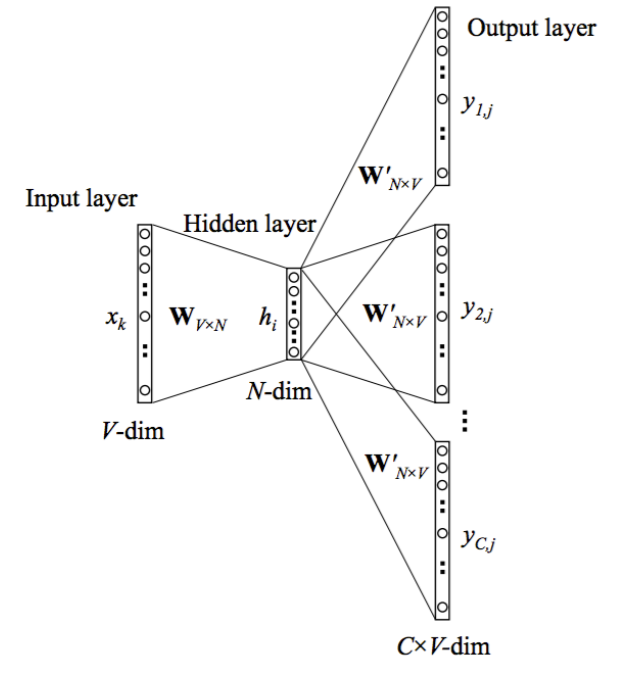

# skip-gram模型

### 用途

训练词向量（Word Embedding）：把词表里的每个词映射成低维稠密向量，使语义相近的词在向量空间里距离更近。

### 基本思想

Skip-gram 的核心是**用中心词预测其上下文词**。

在语料上滑动固定窗口（如窗口大小为 2，即左右各看 2 个词）。每次取一个**中心词** $$w_c$$，窗口内的其他词就是它的**上下文词** $$w_o$$。每对 $$(w_c, w_o)$$ 构成一条训练样本。

直觉上：若两个词经常出现在相似的上下文里，它们的向量应该相近——模型通过大量「猜上下文」的样本，把这一规律学进向量里。

### 模型结构

Skip-gram 本质上是一个**单层的全连接神经网络**（见 [全连接神经网络](./全连接神经网络.md)）：只有「输入 → 隐藏层 → 输出层」三段，中间没有更深的隐藏层。整体呈**瓶颈结构**——输入、输出都是 $$V$$ 维（词表大小），隐藏层压到 $$N$$ 维（词向量维度，通常 $$N \ll V$$），结构如下图所示。

    

设词表大小为 $$V$$，词向量维度为 $$N$$，窗口内共有 $$C$$ 个上下文词需要预测。

#### 输入层（$$V$$ 维）

中心词 $$w_c$$ 用 one-hot 向量 $$\mathbf{x}_k \in \{0,1\}^V$$ 表示——仅第 $$c$$ 维为 1，其余为 0。维度等于词表大小 $$V$$。

#### 输入层 → 隐藏层：权重矩阵 $$W_{V \times N}$$

输入与隐藏层之间是全连接，权重矩阵 $$W \in \mathbb{R}^{V \times N}$$。one-hot 与 $$W$$ 相乘，等价于**查表**：直接取出 $$W$$ 的第 $$c$$ 行，得到该词的词向量。

$$
\mathbf{h}_i = W^\top \mathbf{x}_k \in \mathbb{R}^N
$$

#### 隐藏层（$$N$$ 维）

$$\mathbf{h}_i$$ 就是中心词的 **$$N$$ 维词向量**（Embedding）。这一层只做线性变换，**没有** ReLU、Sigmoid 等非线性激活——和 Word2Vec 原始 Skip-gram 一致。

#### 隐藏层 → 输出层：权重矩阵 $$W'_{N \times V}$$

隐藏层到输出层同样是全连接，权重矩阵 $$W' \in \mathbb{R}^{N \times V}$$。图中输出端分出 $$C$$ 路，对应窗口内的 $$C$$ 个上下文位置；**这 $$C$$ 路共享同一个 $$W'$$**。

对第 $$t$$ 个上下文位置（$$t = 1, \ldots, C$$）：

$$
\mathbf{z}_t = {W'}^\top \mathbf{h}_i \in \mathbb{R}^V, \qquad
\hat{\mathbf{p}}_t = \mathrm{Softmax}(\mathbf{z}_t)
$$

#### 输出层（$$C \times V$$ 维）

每一路输出都是 $$V$$ 维向量 $$\mathbf{y}_{t,j}$$（图中记为 $$y_{1,j}, y_{2,j}, \ldots, y_{C,j}$$），经 Softmax 归一化后，第 $$j$$ 维表示：

$$
\hat{P}(w_j \mid w_c) = \frac{e^{z_{t,j}}}{\sum_{k=1}^{V} e^{z_{t,k}}}
$$

即在已知中心词 $$w_c$$ 时，第 $$t$$ 个上下文位置出现词 $$w_j$$ 的预测概率。每一路输出都是一个定义在词表上的概率质量函数（PMF）。

#### 结构小结

| 层 | 维度 | 权重 | 说明 |
| --- | --- | --- | --- |
| 输入层 | $$V$$ | — | 中心词 one-hot $$\mathbf{x}_k$$ |
| 隐藏层 | $$N$$ | $$W_{V \times N}$$ | 词向量 $$\mathbf{h}_i$$，无激活函数 |
| 输出层 | $$C \times V$$ | $$W'_{N \times V}$$（共享） | 每路 Softmax → 上下文词概率分布 |

训练完成后，**$$W$$ 的每一行就是对应词的词向量**；$$W'$$ 只参与训练，推理时通常丢弃。

### 标签：上下文词的 one-hot

训练数据里，中心词周围的上下文词是**确定的**（来自语料窗口）。对样本 $$(w_c, w_o)$$，标签就是上下文词 $$w_o$$ 的 one-hot 向量 $$\mathbf{y} \in \{0,1\}^V$$（仅第 $$o$$ 维为 1）。

于是每个训练样本都有：

- **预测分布** $$\hat{\mathbf{p}}$$：模型输出的 $$V$$ 维概率
- **真实分布** $$\mathbf{y}$$：上下文词的 one-hot（硬标签）

### 损失函数

对单条样本，真实标签为 one-hot $$\mathbf{y}$$，预测为 $$\hat{\mathbf{p}}$$，损失为交叉熵（与 [逻辑回归模型的 loss 函数](./逻辑回归模型的loss函数.md) 中多分类形式一致）：

$$
\ell = -\sum_{j=1}^{V} y_j \ln \hat{P}(w_j \mid w_c)
$$

由于 $$\mathbf{y}$$ 是 one-hot，只有 $$y_o = 1$$，其余为 0，上式退化为：

$$
\ell = -\ln \hat{P}(w_o \mid w_c)
$$

含义很直观：**最大化真实上下文词 $$w_o$$ 的预测概率**，等价于最小化它的负对数似然。

对整个语料，把所有 $$(w_c, w_o)$$ 样本的 loss 相加（或取平均），用梯度下降同时更新 $$W$$ 和 $$W'$$。

### 小结

1. 输出经 Softmax 归一化后，第 $$j$$ 维 = 预测「上下文词是 $$w_j$$」的概率。
2. 语料窗口给出确定的上下文词 → 标签 = 该词的 one-hot。
3. 预测 PMF + one-hot 标签 → 多分类交叉熵 loss，模型形式就是 **Softmax 回归**（逻辑回归的多分类推广）。
4. 词向量存在 $$W$$ 里，通过「猜上下文」这一监督信号学出来。
