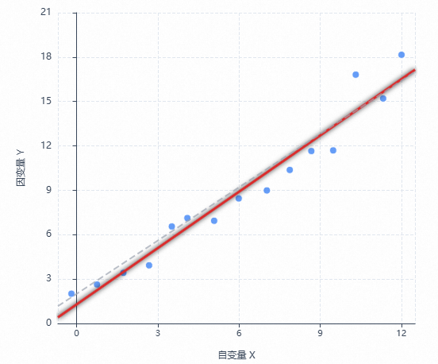

# 线性回归模型

### 什么是线性回归模型？

**一元线性回归**最直观：在平面直角坐标系里给定 $$m$$ 个样本点 $$(x_i, y_i)$$（$$i = 1,\ldots,m$$），希望用一条直线

$$y = wx + b$$

刻画自变量 $$x$$ 与因变量 $$y$$ 之间的线性关系，使直线在整体上尽可能贴近这些散点，如下图所示。

    

其中 $$w$$ 为斜率，$$b$$ 为截距。**线性回归**要解决的问题，就是在选定的误差准则下求出使拟合最优的 $$w$$ 与 $$b$$。

### loss函数

**loss 函数**（损失函数，也常写作 **cost**）把「模型预测得好不好」量化成一个标量：对每个样本，比较真实值 $$y_i$$ 与模型预测值 $$\hat{y}_i = wx_i + b$$ 的差异，再把所有样本上的差异按某种规则合成一个数。这个数越大，说明拟合越差；越小，说明直线整体越贴近数据。

**为什么要用 loss？** 仅凭肉眼很难唯一、公允地断定哪条直线「最好」。要在数学上讨论「最优」的 $$w$$、$$b$$，就需要一个**明确、可计算**的准则。做法很直接：在每个样本的同一个 $$x_i$$ 上，看直线给出的预测 $$\hat{y}_i = wx_i + b$$ 和真实值 $$y_i$$ 差多少，所以需要一个函数可以计算不同 $$w$$ 和 $$b$$ 取值下预测值和真实值的差异度，这个函数就是loss函数。

对一元线性回归，最常用的形式是**均方误差**（MSE）或与之差一个常数因子的**平方和误差**。例如取 $$m$$ 个样本时，可写成

$$\mathcal{L}(w, b) = \frac{1}{m} \sum_{i=1}^{m} \bigl(y_i - (wx_i + b)\bigr)^2.$$

每一项 $$\bigl(y_i - (wx_i + b)\bigr)^2$$ 表示第 $$i$$ 个点在竖直方向上的预测误差（残差）的平方；平方会放大较大误差的影响，且处处可导，便于优化（绝对值也能反映预测值与真实值之间的误差，但在 $$0$$ 处不可导，优化上不如平方方便）。

**目的**可以一句话概括：在选定的 loss 定义下，**求出一组 $$w$$ 和 $$b$$，使 loss 函数的值最小**，对应的直线就是在该准则下的最优拟合。

### loss函数的梯度

loss函数表示的是预测值和真实值之间的差异，训练模型的目的是想办法让Loss最小化，常用做法是求 **loss 对参数的梯度** $$\nabla\mathcal{L}$$：梯度指向函数值上升最快的方向，沿 **负梯度** 走一步就能让 $$\mathcal{L}$$ 下降（梯度下降）

记第 $$i$$ 个样本的预测值为 $$\hat{y}_i = wx_i + b$$，残差为 $$e_i = y_i - \hat{y}_i = y_i - wx_i - b$$，则

$$\mathcal{L}(w, b) = \frac{1}{m}\sum_{i=1}^{m} e_i^2.$$

对 $$w$$ 求偏导时，$$\dfrac{\partial e_i}{\partial w} = -x_i$$；对 $$b$$ 求偏导时，$$\dfrac{\partial e_i}{\partial b} = -1$$。由链式法则 $$\dfrac{\partial}{\partial \theta} e_i^2 = 2e_i \dfrac{\partial e_i}{\partial \theta}$$，有

$$\frac{\partial \mathcal{L}}{\partial w}
= \frac{1}{m}\sum_{i=1}^{m} 2e_i \cdot (-x_i)
= -\frac{2}{m}\sum_{i=1}^{m} x_i\,\bigl(y_i - wx_i - b\bigr),$$

$$\frac{\partial \mathcal{L}}{\partial b}
= \frac{1}{m}\sum_{i=1}^{m} 2e_i \cdot (-1)
= -\frac{2}{m}\sum_{i=1}^{m} \bigl(y_i - wx_i - b\bigr).$$

于是 **梯度**（按 $$(w, b)$$ 顺序排成向量）为

$$\nabla \mathcal{L}(w, b) = \begin{pmatrix} \dfrac{\partial \mathcal{L}}{\partial w} \\ \dfrac{\partial \mathcal{L}}{\partial b} \end{pmatrix}.$$

它与上文的 $$\mathcal{L}$$ 直接对应：把当前 $$w,b$$ 代入上两式，就得到该点处「往哪个方向调参数会让 MSE 变化最快」的信息；迭代地沿 $$-\nabla\mathcal{L}$$ 更新 $$w,b$$

### 反向更新 $$w$$ 和 $$b$$ ，梯度回传

所谓 **反向更新**，就是：先按当前 $$w,b$$ 从输入 $$x_i$$ **前向**算出 $$\hat{y}_i$$ 和 $$\mathcal{L}$$，再按链式法则把误差信号从 **loss 端** 传回到 **参数端**，得到每个参数应朝哪边、动多少，最后用 **梯度下降** 把 $$w,b$$ 往减小 $$\mathcal{L}$$ 的方向挪一步。深度网络里常说的 **反向传播**（backprop），本质也是同一套链式法则；这里只有一层线性变换，所以公式就是上节那两条偏导，没有多层可展开的中间变量。

取 **学习率** $$\eta > 0$$（步长，常取较小正数），一次更新写为

$$w \leftarrow w - \eta\,\frac{\partial \mathcal{L}}{\partial w},
\qquad
b \leftarrow b - \eta\,\frac{\partial \mathcal{L}}{\partial b}.$$

把前面 MSE 的偏导代入，即

$$w \leftarrow w + \eta\,\frac{2}{m}\sum_{i=1}^{m} x_i\,\bigl(y_i - wx_i - b\bigr),
\qquad
b \leftarrow b + \eta\,\frac{2}{m}\sum_{i=1}^{m} \bigl(y_i - wx_i - b\bigr).$$

### 迭代与收敛

经过多轮 **梯度下降** 后，$$\mathcal{L}$$ 往往会逐渐下降并趋于稳定（是否严格收敛取决于学习率、数据与初始化等）。当 loss 基本不再明显下降时，当前得到的 $$w$$、$$b$$ 即可视为在该准则下训练出的结果。

### 多维特征：$$\mathbf{w}$$ 为向量时的 loss 与梯度

前面为了一目了然，把自变量写成了标量 $$x_i$$。实际中每个样本往往有 **多个特征**，记第 $$i$$ 个样本的特征向量为 $$\mathbf{x}_i \in \mathbb{R}^d$$（$$d$$ 维），待求权重为 $$\mathbf{w} \in \mathbb{R}^d$$，偏置仍为标量 $$b$$。模型写成

$$\hat{y}_i = \mathbf{w}^\top \mathbf{x}_i + b = \sum_{j=1}^{d} w_j x_{ij} + b,$$

多维特征情况下，loss 仍是标量，**梯度**为 $$(d+1)$$ 维向量：对每个权重分量 $$w_j$$ 与偏置 $$b$$ 各有一个偏导，按顺序排成列向量

$$\nabla \mathcal{L}(\mathbf{w}, b) = \begin{pmatrix} \dfrac{\partial \mathcal{L}}{\partial w_1} \\ \vdots \\ \dfrac{\partial \mathcal{L}}{\partial w_d} \\ \dfrac{\partial \mathcal{L}}{\partial b} \end{pmatrix} = \begin{pmatrix} \nabla_{\mathbf{w}} \mathcal{L} \\ \dfrac{\partial \mathcal{L}}{\partial b} \end{pmatrix}.$$