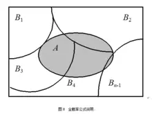

# 全概率公式和贝叶斯公式

### 背景知识

**完备事件组**

设样本空间为 $$\Omega$$，事件 $$B_1, B_2, \ldots, B_n$$ 满足：

1. **两两互斥**：$$i \neq j$$ 时，$$B_i \cap B_j = \emptyset$$（不会同时发生）
2. **并集覆盖全集**：$$B_1 \cup B_2 \cup \cdots \cup B_n = \Omega$$（必然发生其中一个）

则称 $$\{B_1, B_2, \ldots, B_n\}$$ 是 $$\Omega$$ 的一个**完备事件组**（也称样本空间的一个划分）。

**交事件概率 / 乘法公式**

由条件概率定义 $$P(A \vert B) = \dfrac{P(AB)}{P(B)}$$（要求 $$P(B) > 0$$），立刻得到乘法公式：

$$
P(AB) = P(B) \cdot P(A \vert B) = P(A) \cdot P(B \vert A)
$$

其中 $$AB$$ 表示交事件 $$A \cap B$$。直观含义：两件事同时发生的概率 = 一件事先发生的概率 × 在它发生的前提下另一件事发生的条件概率。

### 全概率公式

如上图：样本空间被完备事件组 $$B_1, B_2, \ldots, B_n$$ 划成互不重叠的几块，事件 $$A$$（灰色区域）被这些边界切成若干小块 $$AB_1, AB_2, \ldots$$。于是：

$$
A = AB_1 \cup AB_2 \cup \cdots \cup AB_n
$$

且各 $$AB_i$$ 两两互斥，所以：

$$
P(A) = \sum_{i=1}^{n} P(AB_i) = \sum_{i=1}^{n} P(B_i)\, P(A \vert B_i)
$$

这就是**全概率公式**：先按「原因 / 场景」拆开，再把各场景下 $$A$$ 发生的概率加总。

**举个例子**

假设你要去学校，有 3 种交通工具（完备事件组）：

| 事件 | 含义 | 先验概率 $$P(B_i)$$ |
|:---:|:---|:---:|
| $$B_1$$ | 坐公交车 | $$0.5$$ |
| $$B_2$$ | 骑自行车 | $$0.3$$ |
| $$B_3$$ | 走路 | $$0.2$$ |

设事件 $$A$$ 为「上学迟到」，各交通方式下的迟到条件概率为：

$$
P(A \vert B_1) = 0.1,\quad P(A \vert B_2) = 0.2,\quad P(A \vert B_3) = 0.4
$$

由乘法公式，例如「坐公交且迟到」的概率：

$$
P(AB_1) = P(B_1) \cdot P(A \vert B_1) = 0.5 \times 0.1 = 0.05
$$

同理可得 $$P(AB_2) = 0.06$$，$$P(AB_3) = 0.08$$。总迟到概率就是三种情境下迟到概率之和：

$$
\begin{aligned}
P(A)
&= P(AB_1) + P(AB_2) + P(AB_3) \\
&= 0.05 + 0.06 + 0.08 = 0.19
\end{aligned}
$$

或直接套全概率公式：

$$
P(A) = 0.5 \times 0.1 + 0.3 \times 0.2 + 0.2 \times 0.4 = 0.19
$$

### 贝叶斯公式

全概率是「由因推果」：已知各原因的概率，求结果 $$A$$ 的总概率。贝叶斯公式则是「由果推因」：已经观察到 $$A$$ 发生了，反推它更可能来自哪个原因 $$B_i$$。

由条件概率与乘法公式：

$$
P(B_i \vert A) = \frac{P(AB_i)}{P(A)} = \frac{P(B_i)\, P(A \vert B_i)}{P(A)}
$$

分母用全概率公式展开，得到**贝叶斯公式**：

$$
P(B_i \vert A) = \frac{P(B_i)\, P(A \vert B_i)}{\displaystyle\sum_{j=1}^{n} P(B_j)\, P(A \vert B_j)}
$$

常用术语：

- $$P(B_i)$$：**先验概率**（先验，prior）——还没看到结果前，对原因的信念
- $$P(A \vert B_i)$$：**似然**（likelihood）——该原因下出现观测 $$A$$ 的可能性
- $$P(B_i \vert A)$$：**后验概率**（后验，posterior）——看到 $$A$$ 之后，对原因的更新信念

**承接上例**

若已知你迟到了（$$A$$ 发生），问「最可能是坐公交来的」的概率：

$$
P(B_1 \vert A) = \frac{P(AB_1)}{P(A)} = \frac{0.05}{0.19} \approx 0.263
$$

同理：

$$
P(B_2 \vert A) = \frac{0.06}{0.19} \approx 0.316,\qquad
P(B_3 \vert A) = \frac{0.08}{0.19} \approx 0.421
$$

尽管走路的先验最小（$$0.2$$），但走路迟到率最高，所以「已经迟到」时，后验上最可疑的反而是走路。先验 $$0.5 / 0.3 / 0.2$$ 被观测更新成约 $$0.26 / 0.32 / 0.42$$。

### 二者关系小结

| | 全概率公式 | 贝叶斯公式 |
|:---|:---|:---|
| 方向 | 由因求果 | 由果求因 |
| 问的是 | $$P(A)$$ | $$P(B_i \vert A)$$ |
| 依赖 | 完备事件组 + 乘法公式 | 全概率作分母 + 乘法公式 |
| 一句话 | 把各场景下的概率加起来 | 用观测把先验更新成后验 |
