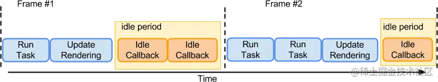

# 浏览器的空闲时间

浏览器的页面是和其他app的显示一样，是一帧一帧的渲染出来的，每一帧的时间是16.6ms，所以浏览器会尽量保证每一帧的时间不超过16.6ms，所以如果每帧要执行的东西（task + render + ...）的时间小于 16ms，就说明这一帧（或者这个周期内）有空闲时间可以利用。

用一张w3c上的图来说明：

    

其中 idle period 就是浏览器空闲的时间，浏览器空闲时间可以用来执行一些优先级不高，但是又不能立即执行的任务，比如一些统计，上报等。

利用这个api也可以做一些其他的事情，比如：资源预加载，卡顿检测等。
